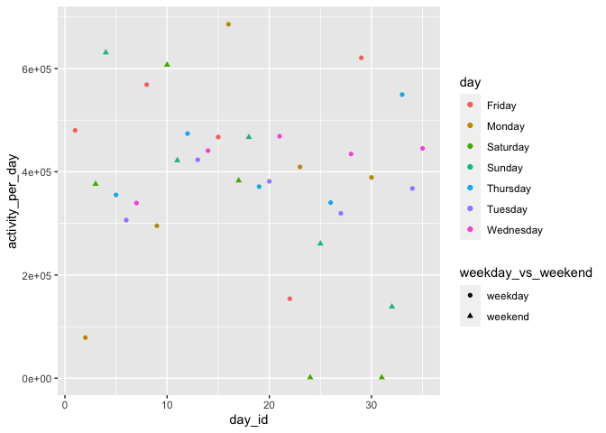
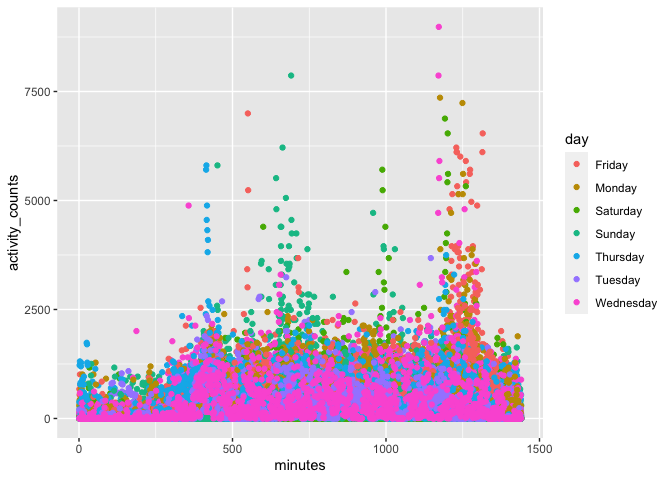
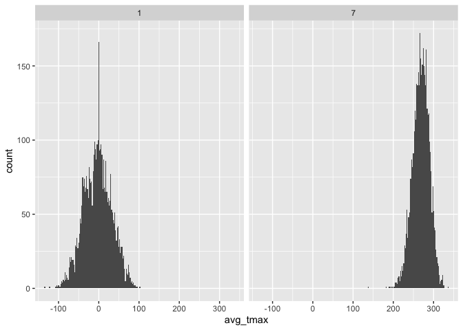
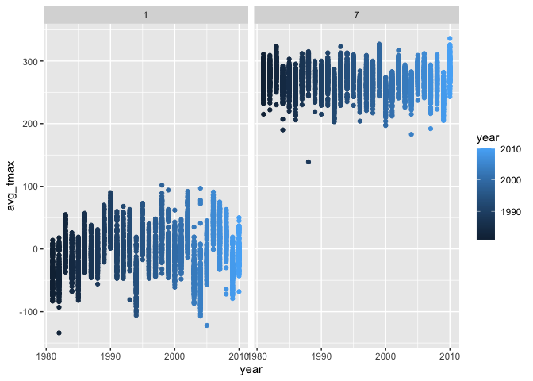

Homework 3
================
Chong Li
10/10/2020

## Problem 1

``` r
data("instacart")

instacart %>%
  count(aisle) %>%
  arrange(desc(n))
```

    ## # A tibble: 134 x 2
    ##    aisle                              n
    ##    <chr>                          <int>
    ##  1 fresh vegetables              150609
    ##  2 fresh fruits                  150473
    ##  3 packaged vegetables fruits     78493
    ##  4 yogurt                         55240
    ##  5 packaged cheese                41699
    ##  6 water seltzer sparkling water  36617
    ##  7 milk                           32644
    ##  8 chips pretzels                 31269
    ##  9 soy lactosefree                26240
    ## 10 bread                          23635
    ## # … with 124 more rows

``` r
instacart %>%
  count(aisle) %>%
  filter(n >= 10000) %>%
  mutate(
    aisle = factor(aisle),
    aisle = fct_reorder(aisle,n)
  ) %>%
  ggplot(aes(x=aisle,y=n)) +
  geom_point() +
  theme(axis.text.x = element_text(angle = 90, vjust = 0.5, hjust = 1))
```

<!-- -->

``` r
instacart %>%
  filter(aisle %in% c("baking ingredients","dog food care","packaged vegetables fruits")) %>%
  group_by(aisle) %>%
  count(product_name) %>% 
  mutate(rank = min_rank(desc(n))) %>%
  filter(rank <= 3) %>%
  arrange(aisle, rank)%>%
  knitr::kable()
```

| aisle                      | product\_name                                 |    n | rank |
| :------------------------- | :-------------------------------------------- | ---: | ---: |
| baking ingredients         | Light Brown Sugar                             |  499 |    1 |
| baking ingredients         | Pure Baking Soda                              |  387 |    2 |
| baking ingredients         | Cane Sugar                                    |  336 |    3 |
| dog food care              | Snack Sticks Chicken & Rice Recipe Dog Treats |   30 |    1 |
| dog food care              | Organix Chicken & Brown Rice Recipe           |   28 |    2 |
| dog food care              | Small Dog Biscuits                            |   26 |    3 |
| packaged vegetables fruits | Organic Baby Spinach                          | 9784 |    1 |
| packaged vegetables fruits | Organic Raspberries                           | 5546 |    2 |
| packaged vegetables fruits | Organic Blueberries                           | 4966 |    3 |

``` r
instacart %>%
  filter(product_name %in% c("Pink Lady Apples","Coffee Ice Cream")) %>%
  group_by(product_name,order_dow) %>%
  summarize(mean_hour = mean(order_hour_of_day)) %>%
  pivot_wider(
    names_from = order_dow,
    values_from = mean_hour
  ) %>%
  knitr::kable()
```

    ## `summarise()` regrouping output by 'product_name' (override with `.groups` argument)

| product\_name    |        0 |        1 |        2 |        3 |        4 |        5 |        6 |
| :--------------- | -------: | -------: | -------: | -------: | -------: | -------: | -------: |
| Coffee Ice Cream | 13.77419 | 14.31579 | 15.38095 | 15.31818 | 15.21739 | 12.26316 | 13.83333 |
| Pink Lady Apples | 13.44118 | 11.36000 | 11.70213 | 14.25000 | 11.55172 | 12.78431 | 11.93750 |

This dataset contains 1384607 rows and 15 columns. Each row represents
one observation of order by the user. There are identifiers of the
users/orders : user ID, order ID, order date, order hour, product ID,
product name. There are also variables that represent the
characteristics of the specific orders such as the time of the order,
whether the product is reordered, the order number. There are also
categories for the products that people order such as isles and
departments.

The most popular isles in the dataset are fresh vegetables, fresh fruits
and packaged vegetable fruits.

## Problem 2

``` r
chf_df = read_csv("./accel_data.csv",col_types = cols()) %>%
  janitor::clean_names() %>%
  pivot_longer(activity_1:activity_1440,
               names_to = "minutes",
               names_prefix = "activity_",
               values_to = "activity_counts" ) %>%
  mutate(minutes = as.numeric(minutes)) %>%
  mutate(activity_counts = as.integer(activity_counts)) %>%
  mutate(weekday_vs_weekend = ifelse(day %in% c("Monday","Tuesday","Wednesday","Thursday","Friday"),"weekday","weekend"))

chf_df
```

    ## # A tibble: 50,400 x 6
    ##     week day_id day    minutes activity_counts weekday_vs_weekend
    ##    <dbl>  <dbl> <chr>    <dbl>           <int> <chr>             
    ##  1     1      1 Friday       1              88 weekday           
    ##  2     1      1 Friday       2              82 weekday           
    ##  3     1      1 Friday       3              64 weekday           
    ##  4     1      1 Friday       4              70 weekday           
    ##  5     1      1 Friday       5              75 weekday           
    ##  6     1      1 Friday       6              66 weekday           
    ##  7     1      1 Friday       7              53 weekday           
    ##  8     1      1 Friday       8              47 weekday           
    ##  9     1      1 Friday       9              55 weekday           
    ## 10     1      1 Friday      10              42 weekday           
    ## # … with 50,390 more rows

``` r
chf_df2 = chf_df %>%
  group_by(week,day_id,day,weekday_vs_weekend) %>%
  summarize(activity_per_day = sum(activity_counts))
```

    ## `summarise()` regrouping output by 'week', 'day_id', 'day' (override with `.groups` argument)

``` r
chf_df2
```

    ## # A tibble: 35 x 5
    ## # Groups:   week, day_id, day [35]
    ##     week day_id day       weekday_vs_weekend activity_per_day
    ##    <dbl>  <dbl> <chr>     <chr>                         <int>
    ##  1     1      1 Friday    weekday                      480280
    ##  2     1      2 Monday    weekday                       78674
    ##  3     1      3 Saturday  weekend                      376254
    ##  4     1      4 Sunday    weekend                      631105
    ##  5     1      5 Thursday  weekday                      355218
    ##  6     1      6 Tuesday   weekday                      306377
    ##  7     1      7 Wednesday weekday                      339402
    ##  8     2      8 Friday    weekday                      568839
    ##  9     2      9 Monday    weekday                      295431
    ## 10     2     10 Saturday  weekend                      607175
    ## # … with 25 more rows

``` r
ggplot(chf_df2,aes(x=day_id,y=activity_per_day)) + 
  geom_point(aes(color = day, shape=weekday_vs_weekend))
```

<!-- -->

This database summarizes the test subjects with CHF who were admitted to
CUMC for activity tracking for 35 days spanning through 5 weeks and 35
days. There are intotal 50400 observations representing 50400 minutes in
total tracked. 6 variables overall. The variables cover the week of the
trial, day of the trial as well as day of the week. The minute variable
depicts the minute number of the day. The activities variable documents
amount of activity per minute. Another added variable is whether the day
is weekend or a weekday.

From the plot, it appears that the activity level on weekdays is higher
than that of weekends. However, this observation could be wrong as on 2
Saturdays the activity level are exceptionally low - probably due to
tracking errors. If that is the case, then it is hard to see that there
is a noticeable difference between weekend and weekday, or amongst the
days of the week.

``` r
ggplot(chf_df,aes(x=minutes,y=activity_counts)) + 
  geom_point(aes(color = day))
```

<!-- --> It
is clear from the graph that there is a pattern for activity levels. The
first 300 minutes and last 500 minutes of the day showed a reduced
activity level. Around 12th hour there is a peak in activity level -
which might have been a result from either work commute or evening
workouts. Activity peaking hours are different for weekends and
weekdays. The data showed that on Sundays the activity level peak just
before noon and on Saturdays they peak in the early afternoon.

### Problem 3

``` r
data("ny_noaa")
noaa_df = ny_noaa %>%
  separate(2,c("year","month","day"),sep = "-")
```

The dataset contains records from over 100,000 stations in 180 countries
and territories. The dataset covers 5 daily variables, including max/min
temperature, snowfall, snow depth and precipitation level. The dataset
has 2.6 million variables. According to the data website, half of the
stations only provide precipitation number, which indicates that there
would be many missing numbers for max and min temerature as well as
snowfall data.

``` r
noaa_df = noaa_df %>%
  mutate(year = as.integer(year)) %>%
  mutate(month = as.integer(month)) %>%
  mutate(day = as.integer(day))%>%
  mutate(prcp = prcp/10)%>%
  mutate(tmax = as.numeric(tmax)) %>%
  mutate(tmin = as.numeric(tmin))


noaa_df %>%
  count(snow) %>%
  arrange(desc(n))
```

    ## # A tibble: 282 x 2
    ##     snow       n
    ##    <int>   <int>
    ##  1     0 2008508
    ##  2    NA  381221
    ##  3    25   31022
    ##  4    13   23095
    ##  5    51   18274
    ##  6    76   10173
    ##  7     8    9962
    ##  8     5    9748
    ##  9    38    9197
    ## 10     3    8790
    ## # … with 272 more rows

The most commonly observed values for snowfall is 0, NA, and 25. The
reason why 0 is the the most commonly observed value probably is due to
the fact that snowing is an uncommon weather occurance for many parts of
the world throughout the year. Only certain regions enjoy snowfall
during a small portion of the year. The missing data value shows shows
that many stations do not report any data other than precipitation.

``` r
new_df = noaa_df %>%
  filter(month == 7 | month == 1)%>%
  group_by(year,month,id) %>%
  summarize(
    avg_tmax = as.integer(mean(tmax,na.rm = TRUE))
  ) 
```

    ## `summarise()` regrouping output by 'year', 'month' (override with `.groups` argument)

``` r
ggplot(new_df,aes(x=avg_tmax)) + 
  geom_histogram(aes(color = year),position="dodge",na.rm=TRUE,binwidth=2) + facet_grid(. ~month)
```

<!-- -->

``` r
ggplot(new_df,aes(x=year, y=avg_tmax)) + 
  geom_point(aes(color = year),na.rm=TRUE) + facet_grid(. ~month)
```

<!-- -->
From the graph it is clear to see that the mean max temperature for
janurary is centered around 0 degree celsius whereas the max temperature
for july hovers around 27 degrees in celsius. From the histogram, it
seems that the mean max temperature follows roughly a normal
distribution.

From the second graph, we cannot find conclusive data that says there is
warming as the max temperature distribution does not seem to shift
higher.
